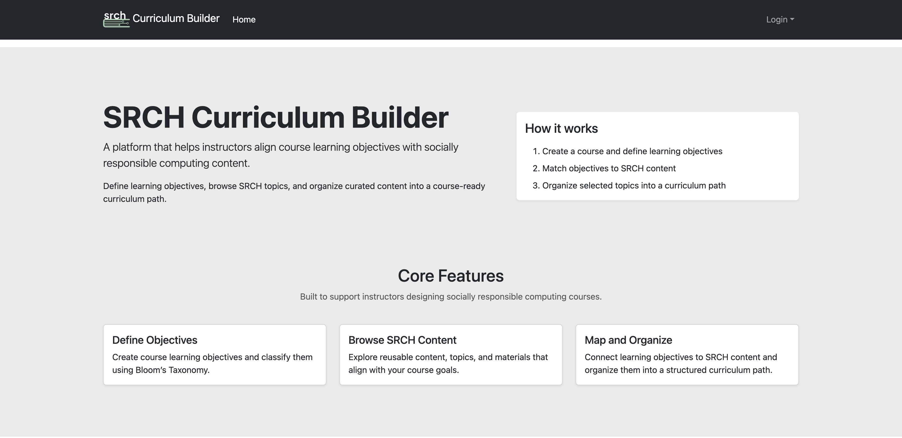

# Keep it Simple, Stupid

## Visualize 
If you have ever made and/or used a template for any type of business project or personal venture, then you already have an idea of the fundamentals of design patterns. Templates are pieces of documentation that act as a structural foundation to guide the implementation of new and similar pieces of work. The same way architectural blueprints follow a baseline to keep a common standard, while allowing room for agency, the same way templates are applied to different works with similar objectives. Typically, these types of pre-formatted designs are set in place to essentially streamline development by increasing efficiency, consistency, and reducing foot work. We can see examples of this in 
systems like MS Word, Canva, and Capcut, to name a few. While each platform represents a different sector of guides, from documents, to presentations, to videos, they all consider the same benefits. These examples reflect the underlying framework of design patterns.

  

### Identify
The first step in applying design patterns lies in the problem itself. While we've come to understand that the use of templates or blueprints aims to introduce a common standardized structure, we must first realize the specific issue requiring a solution. 
For example, writing several lines of code, in any respect, can lead to inflexibility. The issue with code being inflexible is that it can only handle a minimal amount of situations. When you want to handle a broad range of instances, it is important to add generalization for reusability. 
After defining the problem, we have to acknowledge the limitations of certain software, as well as finding an appropriate pattern to resolve it. This is the most important step in applying design patterns, as it accounts for analysis and informed selection. 

### Rough Draft
Once the problem and solution are defined, an initial plan should be devised. This can look like jotting down ideas, or lines of code to get started. This is to brainstorm and explore the different ways the change can be executed. We want to show the tangibility of our proposed solution, and how it works. It also leaves room for trial and error, without consequence, and with that, helps efficiency. Overall, this is a preparatory step that precedes any finalized decisions made. 

### A KISS Revision
Once a feasible rough draft is obtained, cleaning and revision is then needed. This means following coding principles to refactor and simplify codes. For example, the acronym "KISS" exemplifies a clean coding principle that advocates for straightforward systems. Keeping it simple means prioritizing clarity, what is the goal with this code? It shouldn't be ambiguous or hard to understand. Readability, is the code easy to follow? It should be simple enough to navigate through, engage with, and easily see errors. Maintainability, is this practical? Can this code be easily updated and revised if need be? Thus, the KISS rule is imperative to follow.

### Final Product 
Once we've ensured the code follows principles which covers simplicity, cleanliness, clear, readable, and maintainable, we can get to a point where we can deploy, publish, or make usable to others for testing and evaluation. Before then, it has to have been tested and proven on your end to make sure that the code is in fact soling the problem at hand, and is not over-engineered. 

## My personal Experience
As I've laid out the concept of design patterns and how to implement them, I have had my own feats with identifying problems and coding practices that highlight simplicity. Working on what could be a large scale web application has tested the limits of my own capabilities. The hardest part has been revealing where errors are coming from on the account of the multitude of updates and interactions from others besides myself. We faced problems with things as simple as user authorization, which we all had different suspected ideas about. This resulted in not being able to progress forward with the rest of the project milestones. Eventually, we realized that credentials were hard coded into the system, instead of allowing them to be individualized. Initially, hard coding this seemed simple at the time due to needing to test the efficiency of the system, yet it caused problems later down the line in development. Sufficed to say, since we caught and fixed the issue early into revision and way before finalizing our site, we are able to confidently say that we have an application that is clear, readable, reusable, and has the ability to scale beyond what it is now. 

  

[View the HTML version](Reflect-On-Design.html)
