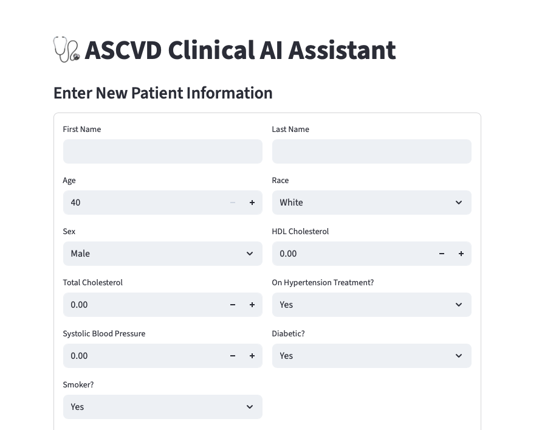
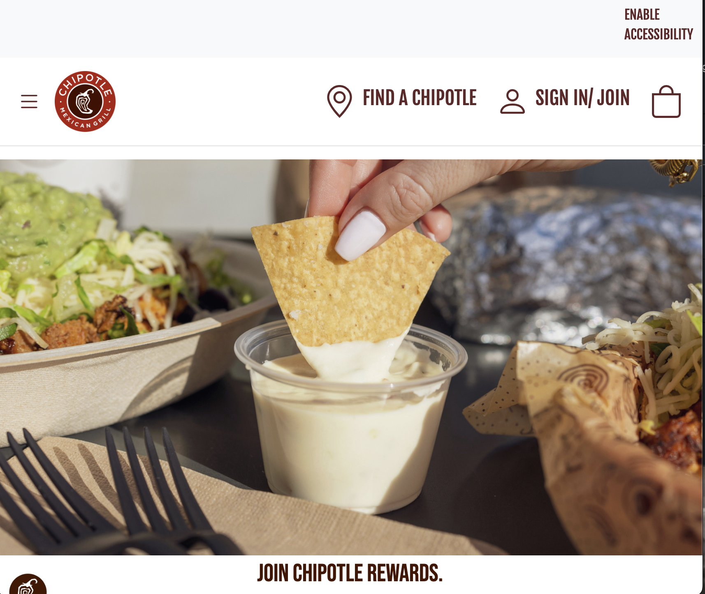

#### There is no right or wrong when it comes to creation, you just do what feels right. 
We inhabit a world where there is no one way to do art. What I like about UI design is that one does not have to be a master artist to create something with meaning. It can be simple, basic, and still comprehensible. UI design is the fun part of software development; you have all the free reign to make a page come to life. 

### My initial experience
My initial experience with user interface design consists of Streamlit on python. Streamlit allows the user to build anything from a dashboard to a functioning prototype of an llm-powered chat application. Streamlit was really fun to work with as a beginner because it was easy to plug and play with many different tools. I started with building very simple generative pages with input text boxes. After a few weeks of debugging and perfecting code, using Streamlit to implement the front-end was the easier part. 

For reference, I made my prototype as basic as possible, given that the calculations, and other medical data was so complex. I wanted it to be readable, easy to work with, as well as managing information. Since the project relied heavily on patient data, I ensured that my application allowed viewing and updating the database as needed.

  

Because this research project’s audience is catered towards cardiology physicians, I didn’t find it important to add different colors and such. The main objective was to make it functional and easy to work with, so it wasn’t intended to have a playful look.

### Read the Room
That brings to the point of “reading the room” when designing anything. It is important to understand context that is either explicitly or implicitly stated in order to push out the best result. As we have continued to work with HTML, Bootstrap 5 and CSS to create and style simple sites, it has been a constant reminder that those stylistic details really make or break the overall composition. 

### Comparing the two
The difference between using Streamlit versus Bootstrap 5 to style a page is flexibility. Streamlit is a resource primarily used for all things in the scope of data science and machine learning, which can involve a multitude of mathematical applications and the integration of AI tools. Bootstrap 5 is more flexible in the sense that it covers a broad range of designs that it may be used for; it is supposed to be more personable and creative. We can create something like a full functioning website for a pizza shop, a clothing store, or even a makeup brand. The tools that Bootstrap 5 have, allow for the use of so many different features to make style specific choices. 

*Here is my recreation of the chipotle homepage using Bootstrap 5*

  

Don't get me wrong, Streamlit can achieve something similar to this, but the difference is that Streamlit would only act as a simulated environment, it would not function like a website. 
So, for a UI that needs to function like a website at some point, using tools like Bootstrap are very helpful to achieve an interactive and innovative environment with many different attributes. 
I do prefer Streamlit solely based on familiarity at this point, but I have also had my fun with Bootstrap 5.

[View the HTML version](Reflect-on-UI-Design.html)
