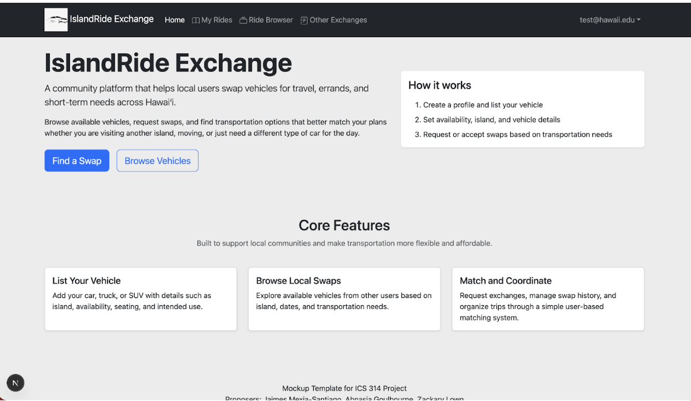
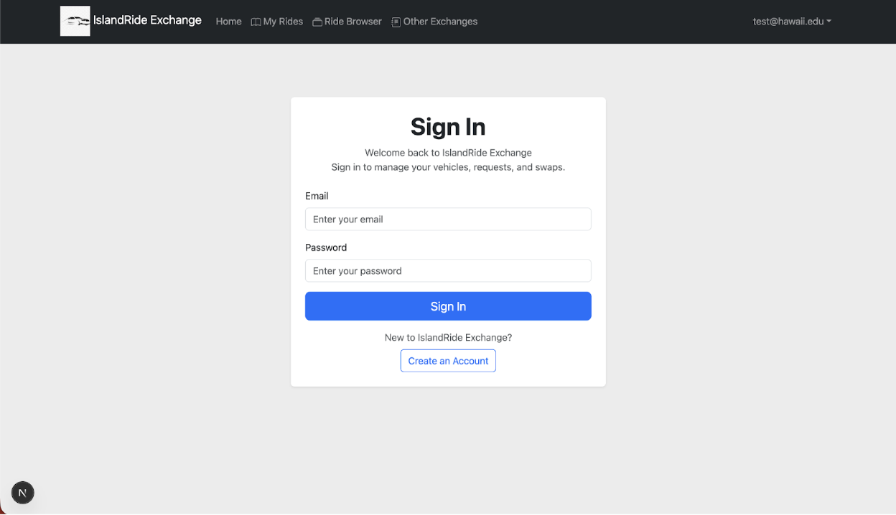
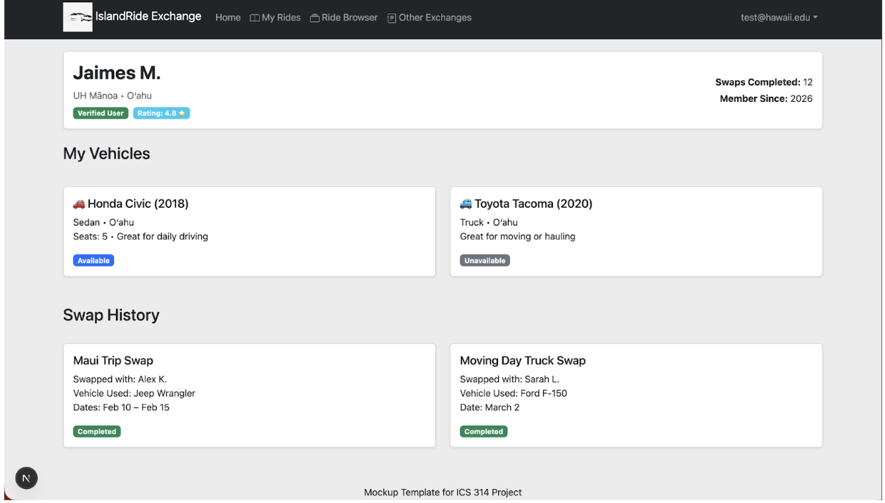
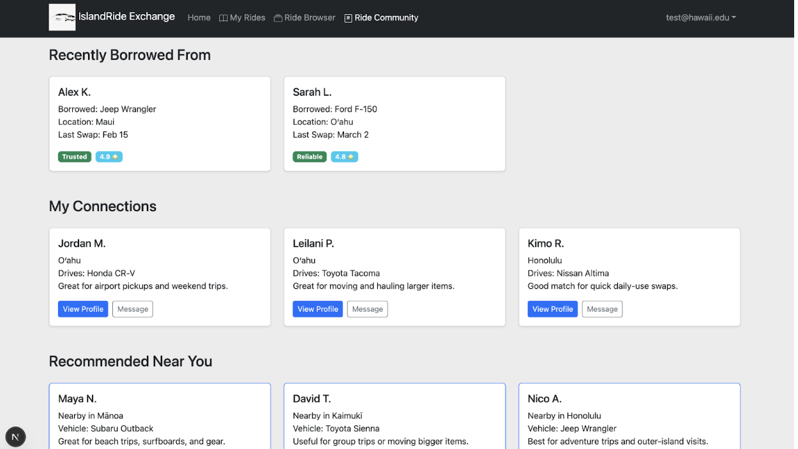
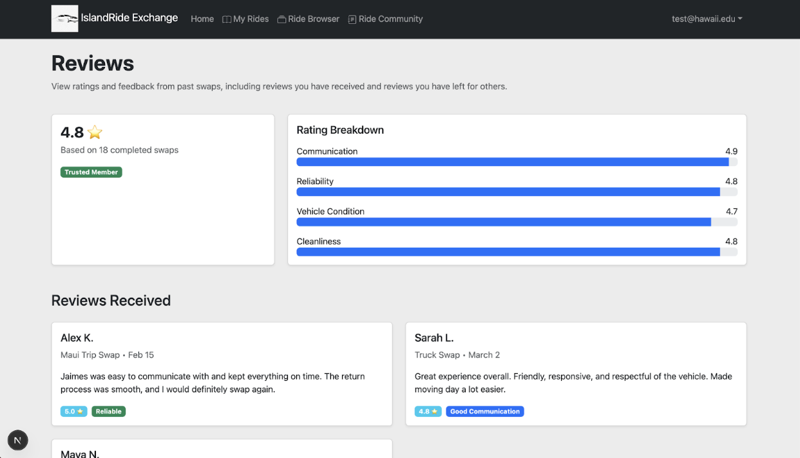

## Project Overview : IslandRide Exchange
The core objectives of this project are to create a peer-to-peer vehicle swap platform that allows Hawai'i residents to:
1. Swap cars between islands upon traveling
2. Borrow/trade vehicles for specific needs
3. Avoid expensive rentals/limited availability
   
**Think Airbnb, but for car exchange instead of renting.**

*Problem* :
 Inter and intra-island travel can often be a headache. Getting around the islands without a car means spending extra money to rent a vehicle and/or using a ride-share service.

*Solution* :
 Instead of that, we propose creating a car swap app: IslandRide Exchange. This app allows people to exchange or trade vehicles for vehicles suitable to their current needs. 

## Approach
Island Ride Exchange has two user roles: swappers and administrators. Any user can swap or be swapped with. Swappers have the autonomy to list and request the swapping of a vehicle, only after registration and verification. Island Ride Admins have the ability to edit listings and verify swapper information. 

Swappers can post profiles that include their name, location and vehicle details. The vehicle details must include condition, valid registration, insurance, and inspection sticker. They can also request to swap vehicles with anyone nearby. They can edit their own listings or requests. Each user may display an image on their page that can host their vehicle as described in their vehicle details. Swappers can accept or deny a request to swap as desired. Swapper rating will also be displayed. 

Island Ride Admins are permitted to remove any suspicious or unverified profiles or listings from the application. Admin is also permitted to removing any inappropriate or threatening ratings/reviews. 

#### Some Possible Mockup Pages Include: 
Home-Page

Login/Register

Profile

Friends/Followers

Reviews

## Use Case Ideas
- New user goes to landing page, logs in, gets home page, sets up profile. 
- Admin goes to landing page, logs in, gets home page, edits site.
- When a user enters the website, they are able to view the revolving listings and are able to login or create an account, and search for profiles to swap to/from.
- Account creation allows the user to create a swapper account.
- Registered users can display their vehicles and make connections with other swappers.
- Registered swapper accounts can connect with other swappers regarding matches.
- All user profiles may contain basic info such as name,location, preferred contact, and vehicle details.
- User profile pages may include images of vehicles they have listed and wish to exchange, as well as swap history.
- Allow swappers to rate one another

## Beyond the Basics
After implementing the basic functionality, here are ideas for more advanced features:
- Expansion of types of exchanges(service exchanges)
- Notify admins of new profiles to verify
- Add event specific tabs for vehicle exchange
- Online Contract for Legal Purposes 

## Faculty Mentor
Brook Conner

## Student Creators
Zackary Lown, Jaimes Mexia-Santiago, Ahnasia Goulbourne

