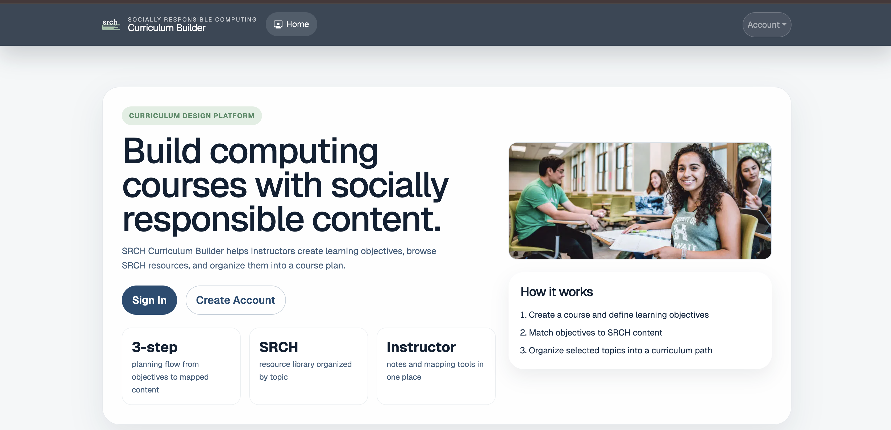
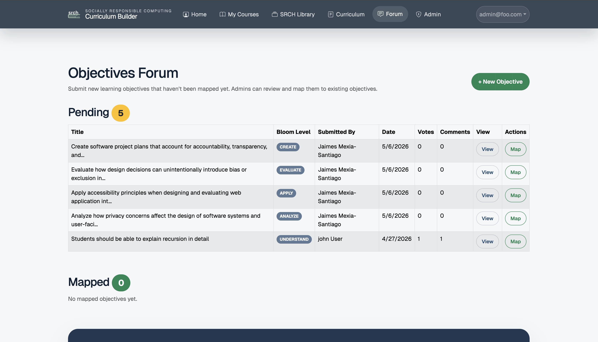
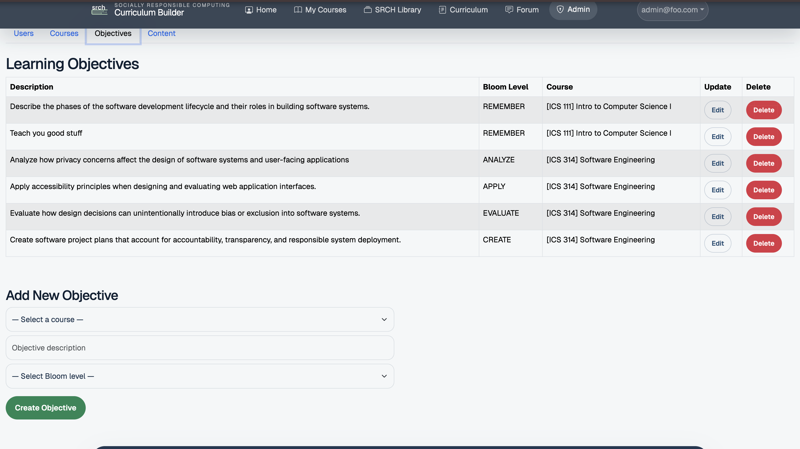

## Overview of Manoa SRCH
SRCH Curriculum Builder has two user roles: instructors and administrators. Instructors are able to browse and view SRCH curriculum currently available, and use the relevant topics to build out their course, and tie it into responsible computer practices. Administrators will be able to manage content posted by Instructors, and review posted content for relevance.

  

Working with a team on this project was extremely rewarding. It allowed me to take my time and strive for perfection, where many time constrained assignments done exclusively alone were nowhere near perfect. My team members were very diligent with their own tasks, but also with lending a hand if needed elsewhere

## Contributions
Some of my major contributions to this application include the Instructor Forum for Unmapped Objectives and expanding Administrative permissions. 

  

Another key function implemented was to deal with that gray area of selecting objectives for an instructor-created course. Not every course and objective will fully match existing content, so providing an instructor forum with these unmapped objectives was key. This allows other instructors and administrators to give advice on where it should go based on its description. This function took loads of trial and error, and was my biggest part in this project. After weeks of playing with this function and trying to perfect it, I was able to make the vision come to life. Not every 

  

Using experiences form earlier in the course where we created a site one step at a time, I was slowly but surely able to implement this function. This page shows what an Admin would be able to see and actions they'd be able to take on their end. Here, Admin Roles are able to create, read, update, or delete anything from content, to users, to courses, to objectives. This provides a layer of security, so that any content that does not align with the intents and purposes of the site can be flagged and removed.

## Key Takeaways
During this project, I truly learned how to collaborate within a solid team of people. This was one of my first experiences being grouped with people who knew what they were doing and had a vision for every concept. It made me much more confident and allowed me to produce more complex and meaningful additions in the end. This project also taught me to be more upfront about things that I don't know or need help with. Because I was working with team members who had a better foundational understanding of what we were doing, they let me know I could rely on them for help or with any questions I might have had, small or big. Lastly, I learned how to be a teammate and not a leader. In the past, I typically assume a leadership role and immediately start delegating roles and responsibilities. This team was a nice break from that. It allowed me to truly learn and grow from both the technical side and the collaborative side. Being the smartest person in the room is never a good thing, because there's no way you can continue to grow. 

[View the Manoa SRCH Organization](https://github.com/manoa-srch)
